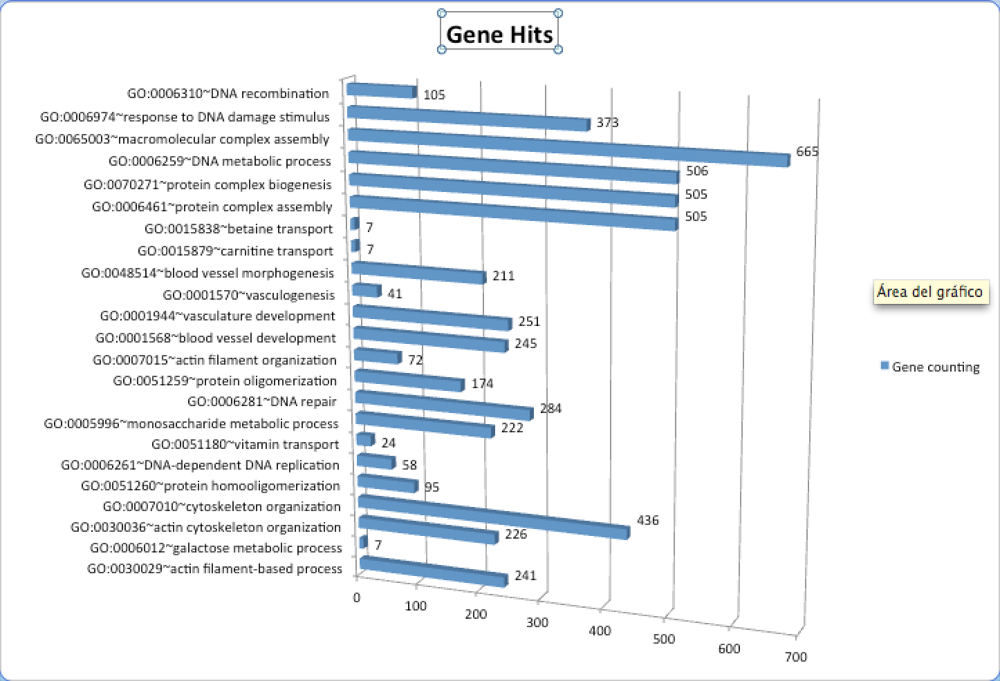

#Hello!!

#These are my results on day 4.

These are the results of my exercise, in this we can see that the gene is more prevalent presents the macromolecular complex assembly.

Biomolecular complex, also called macromolecular complex or biomacromolecular complex, is any biological complex made of more than one molecule of protein, RNA, DNA,lipids, carbohydrates. The interactions between these biomolecules are non-covalent.  Examples:

1) protein complexes: proteasome, DNA polymerase III holoenzyme, RNA polymerase II holoenzyme, symmetric viral capsids, complex of GroEL and GroES, photosystem I, ATP synthase
2) RNA-protein complexes: ribosome, spliceosome, vault, SnRNP. Such complexes in cell nucleus are called ribonucleoproteins (RNPs).
3) DNA-protein complexes: nucleosome
4) Protein-lipid complexes: lipoprotein

The term macromolecular assembly refers to massive chemical structures: such as viruses and non-biologic nanoparticles, cellular organelles and membranes and ribosomes, etc. That are complex Mixtures of polypeptide, polynucleotide, polysaccharide or other polymeric macromolecules.

The complexes of macromolecules That Referred to  are Occur ubiquitously in nature, Where They are Involved in the construction of all living cells and viruses. In Addition, They play key roles in all basic life Processes (protein translation, cell division, vesicle trafficking, intra- and inter-cellular compartments Between exchange of materials, etc.). In each of These roles, complex Mixtures of Become organized in specific structural and spatial ways.

