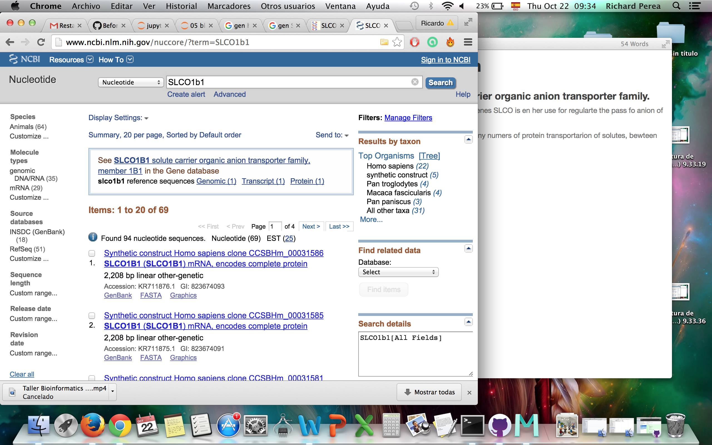
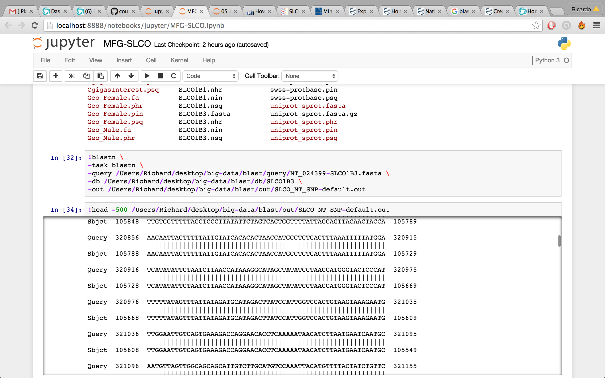

#My favorite Gene

###Gen SLCO1B1  Solute Carrier organic anion transporter family.

Well, the need of know the family of genes SLCO is en her use for  regularte the pass fo anion of ¨plasma¨to intracellular state.  

In the family of SLCO we found so many numers of protein transportarion of solutes, bewteen found the OAL.

so many drugs are eliminate of organism by this transporter family.

####this gen is very important!

#my step list

#first i will get de data base.

#for this i will down secuenses of my gene interest, 

  
 
 
 
#then will goto de make de database

 
#Then will do the blast.
 
 
 
 
 #And see the producto of analysis
 
 
 
 ##and we have  the mach
 
 
 
 
 
 
 